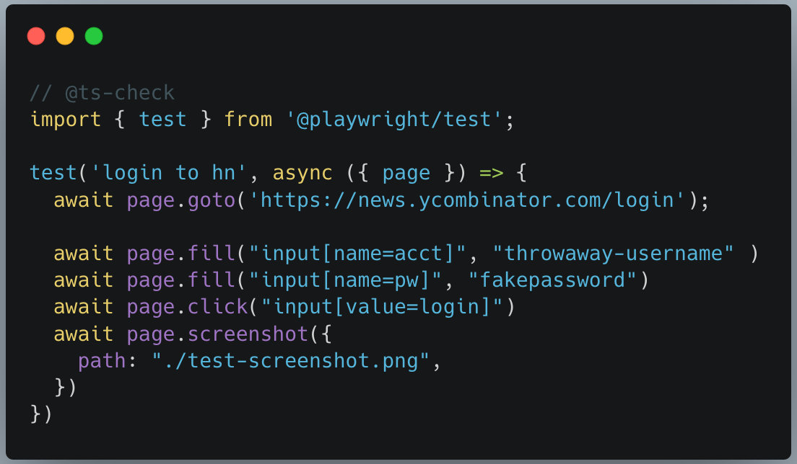

# Welcome to the basi docs

`basi` helps automate browser actions via Playwright and a simple language that anyone can learn.
Browser automation steps are written in `.basi` files.

> NOTE: `basi` is still in very early development.

Here is a quick comparison.

<table border="0px">
  <tr>
    <td>
      <strong>Using basi</string>
    </td>
    <td>
      <strong>Using Playwright with Node JS</string>
    </td>
  </tr>
  <tr>
    <td>
      
    </td>
    <td>
      
    </td>
  </tr>
</table>

Check out our [Quickstart Guide](./quickstart.md)
